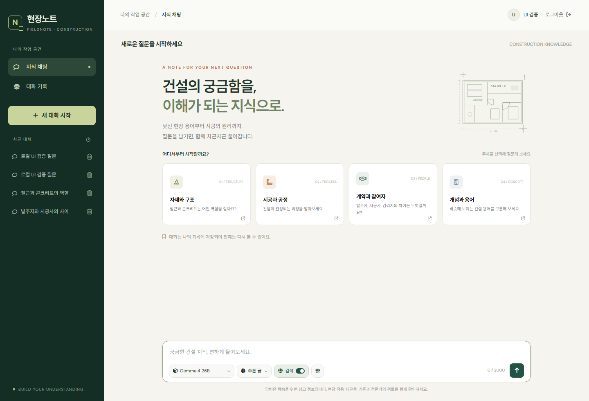
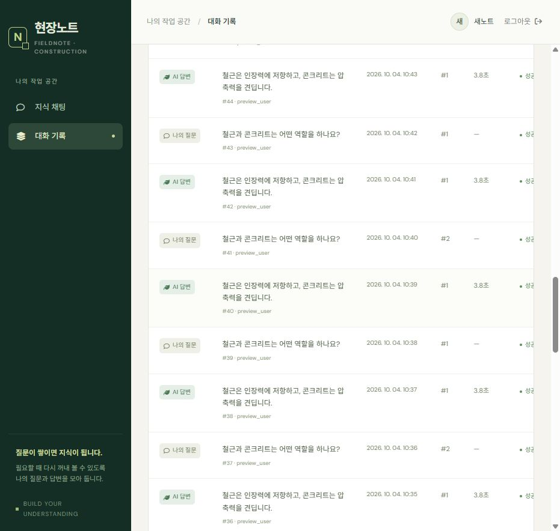
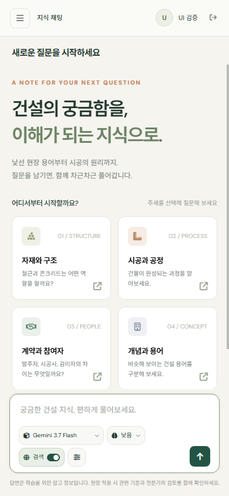

# 화면 구성과 UI 검증

## 채팅

입력창 하단 도구 모음에 모델·추론 선택, 웹검색스위치, 생성옵션과 전송버튼을 배치합니다. 모델 변경 시 지원하는 추론 수준을 다시 구성하고 답변 중에는 조작을 잠급니다. 검색근거가 반환되면 출처·실행상태·검색제안을 표시합니다.

## 기록과 인증

기록은 전체통계와 현재페이지 검색을 구분합니다. 상태필터·50개 단위페이지·전체본문상세를 지원합니다. 회원가입은 닉네임·8자이상 비밀번호·확인일치를 검사합니다.

## 구현

- chat.js: SSE이벤트/문자조각 조립, 중복전송/대화전환 잠금, 한국어조합중 Enter방지
- ui.js: Marked → DOMPurify, 라이브러리없음 시 텍스트표시
- logs.js: 조회요청번호로 오래된응답 배제, 통계와 현재페이지 분리

## 검증 항목

- [ ] 지원하지 않는 추론선택이 모델변경 뒤 남지 않음
- [ ] 키보드로 모델·추론·검색·생성옵션·전송 접근
- [ ] 390px모바일에서 페이지 전체 가로넘침 없음
- [ ] 모델한도/검색거절/빈답변/시간초과 안내와 전송잠금 해제
- [ ] 검색출처·제안 표시와 기록재조회

## 화면 예시

채팅 스크린샷은 로컬 검증 데이터로 확인한 입력창 도구 모음입니다. 기록·로그인 화면은 같은 공통 디자인을 사용합니다.

